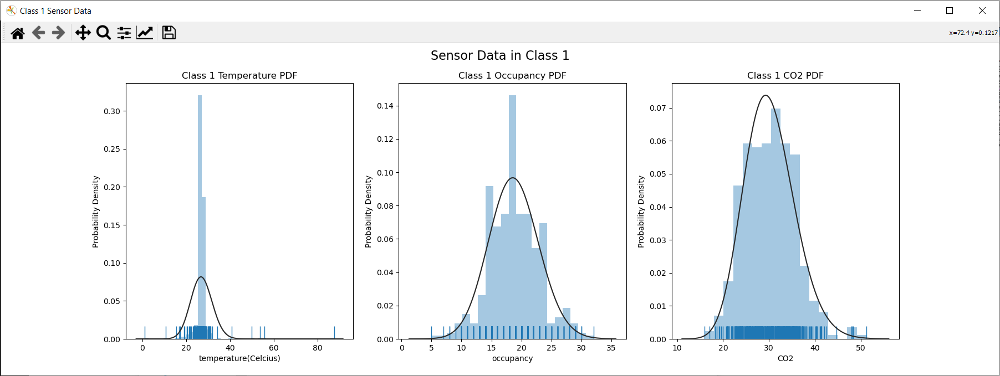

# MiniProject – Sensor Simulation
Authors: Ivan Barcenes, Yuting Chen

2020-09-17

## Task 0
After running the Python code on our computers, the greeting string issued by the server to the client upon first connecting is 
```sh
ECE Senior Capstone IoT simulator
```
<center></center>  


## Task 1
Python code was added to the websocket client that saves JSON data to a text file as it comes in message by message. The name of this file is "client_data.txt". This file was added to the repo.

## Task 2
Now we have all sensor data in "client_data.txt". We then analyze the temperature and occupancy data in class 1 by using Pandas. Then we use seaborn to plot the probability density function for the three sensors in class1.
```sh
----------Calculate medians and variances----------

Median temperature in class 1: 26.9858
Variance in temperature in class 1: 19.2407

Median occupancy in class 1: 19.0000
Variance in occupancy in class 1: 17.1122
```

After that, we calculate the median and variance of time intervals of all sensor readings. Here we use Numpy, as the time index array is a ndarray. We then use seaborn to plot the probability density function. 
```sh
Median of time intervals: 0.6917
Variance in time intervals: 0.9325
```
<center></center>  
The probability density function of time intervals mimics log-normal distribution. Log-normal distribution is a continuous probability distribution of a random variable whose logarithm is normally distributed. It is often used when modeling stock prices and semiconductor lifetime. 
<center></center> 
<center></center> 


## Task 3
An algorithm was made using python code which which detects anomalies in tbe tempeture data from class1, and then prints out the percent of bad data. The code then deletes the bad data and prints the median and variance before and after the anomalies were removed.
```sh
The percentage of "bad" data points for class1 is 1.6353%
The temperature median and variance with these anomalies removed are,
Median: 26.9937
Variance: 0.9509

In comparison the median and variance with these anomalies are,
Median: 26.9858
Variance: 19.2407
``` 

Analyzing the data in the text file generated in Task 1 we see that when an anomally occurs the subsqequent sensor readings are reasonable. If this this simulation where a real sensor, however I think this data would indicate a failed sensor since the data at times comes in within seconds of each other so I would not expext the temperature of a classroom to fluctuate as much as it does. While there are relatively few anomalies, the data does fluctuate about the median, usually by about 5 degrees give or take.

There are three different room types for data is collected and they are "class1", "lab1", and office. Under the assumption that the temperature data is read in degrees celcius, I would say that reasonable bounds for temperature readings of each room are:        
- **Class1**: 15-30 degrees celcius     ---    This a typical range of temperatures which could be in a classroom, depending on seasonal weather.   
- **Lab1**: 15-25 degrees celcius       ---    The temperature  is typical for a lab, with less room for fluctuation for tempetaure sensitive lab work.   
- **Office**: 15-30 degrees celcius     ---    Like the class, this is typical range of an office with depending on the seasonal weather.

<center></center> 

## Task 4
1. This simulation is reflective of the real-world because many sensors use websocket comunication to relay data. In many cases this data is saved and analyzed and checked for anomalies. Sensors are not perfect, so there will be variability in sensor readings like in this simulation.
2. This simulation is defficient in that some of the data is not realistic, as the data for temperature, occupancy, and co2 fluctuates significantly in a short period of time. Realistically a sensore will sends information less frequently, and ideally without as much fluctuation. Another area in which the simulation is defiecient is that there is a high level in precision in the temperature and co2 data. Being that the data fluctuates the data is probably not that accurate and so the data can be sent with 2 or 3 decimal places. This would improve readability.
3. Intepreted vs Compiled
4. Better to have sensors reach out when having data

## References
- [The Lognormal Distribution vs. the Normal Distribution](https://analystprep.com/cfa-level-1-exam/quantitative-methods/lognormal-distribution/)